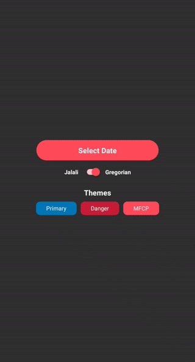

<h1 align="center">Global DateTime Picker</h1>

<div align="center">
    <p><a href="https://github.com/AliRezaBeigy/react-native-global-datetimepicker/blob/master/LICENSE"></a>
    <a href="http://makeapullrequest.com"></a>
    
    
    </p>
</div>

This package is a global, beautiful, customizable date and time picker for React Native.

## Features

- Customizable theme
- Customizable translation
- Support Jalali(Shamsi) and Gregorian

# Demo
<p align="center">
  
</p>

# Installation
Install it using Yarn:
```shell
$ yarn add react-native-global-datetimepicker
```
Of if you prefer NPM:
```shell
$ npm i react-native-global-datetimepicker
```

# Basic Import
After the installation, it's time to import the package in your app:
```ts
import GlobalDateTimePicker, {
    CalendarType,
    weekDaysJalali,
    yearMonthsJalali,
    DateTimePickerThemes,
    DateTimePickerTranslations,
} from 'react-native-global-datetimepicker';
```
Great job! You're all set. It's time to write some code now.

# Basic Usage
Let's kick things off by providing an example:
```tsx
import React, {useState} from "react";
import GlobalDateTimePicker from 'react-native-global-datetimepicker';

export default function App() {
    const [ShowDateTimePicker, setShowDateTimePicker] = useState(false);
    const [SelectedDateJalali, setSelectedDateJalali] = useState<Date>();
    const [SelectedDateGregorian, setSelectedDateGregorian] = useState<Date>();
    return (
        <GlobalDateTimePicker
            visible={ShowDateTimePicker}
            initialDate={SelectedDateGregorian}
            onSelect={(gregorianDate, jalaliDate) => {
                setShowDateTimePicker(false);
                setSelectedDateJalali(jalaliDate);
                setSelectedDateGregorian(gregorianDate);
            }}
            onCancel={() => setShowDateTimePicker(false)} 
        />
    );
}
```
- `visible` prop is the state of visibility of the date picker
- `initialDate` prop is the initial value for the date picker, **this date value should be gregorian**
- `onSelect` prop is a function that will take care of changing the date by the user
- `onCancel` prop is a function that will take care of dismissing date picker by the user

# Advanced Usage
Let's give an advanced example to use
```tsx
import React, {useState} from "react";
import GlobalDateTimePicker from 'react-native-global-datetimepicker';

export default function App() {
    const [ShowDateTimePicker, setShowDateTimePicker] = useState(false);
    const [SelectedDateJalali, setSelectedDateJalali] = useState<Date>();
    const [SelectedDateGregorian, setSelectedDateGregorian] = useState<Date>();
    return (
        <GlobalDateTimePicker
            persianNumber={true}
            visible={ShowDateTimePicker}
            calendar={CalendarType.Jalali}
            theme={DateTimePickerThemes.Danger}
            initialDate={SelectedDateGregorian}
            translation={DateTimePickerTranslations.fa}
            onSelect={(gregorianDate, jalaliDate) => {
                setShowDateTimePicker(false);
                setSelectedDateJalali(jalaliDate);
                setSelectedDateGregorian(gregorianDate);
            }}
            onCancel={() => setShowDateTimePicker(false)} 
        />
    );
}
```
- `persianNumber` prop enables the converter that converts English number to Arabic number
- `calendar` prop is the type of calendar the date picker should be used, there are two types of calendar
  type available in the library that you can import as **CalendarType**, the current calendar
  type is **Gregorian** and **Jalali**, default calendar type is **Gregorian**
- `theme` prop is an object that contains the color of each part of the component, there are three themes available
  in the library that you can import as **DateTimePickerThemes** and use them, the currently available theme
  is **Primary** and **Danger** and **MFCP**, the default theme is **Primary**, also you can create your
  own theme, the interface is like:
```js
const MFCP = {
    DayText: '#232323',
    HeaderDay: '#ffc4c9',
    HeaderYear: '#ffc4c9',
    SelectedDay: '#ff4d5b',
    WeekDayText: '#a9a9a9',
    YearItemText: '#232323',
    TodayDayText: '#ff4d5b',
    ButtonRipple: '#2323231A',
    SelectedDayText: '#ffffff',
    SelectDayRipple: '#ff4d5b',
    HeaderBackground: '#ff4d5b',
    HeaderSelectedMode: '#ffffff',
    SelectedYearItemText: '#ff4d5b'
}
```
- `translation` prop is an object that contains the text of each part of the component. There are two languages supported units now that you can import as **DateTimePickerTranslations** and use them. The currently available language is **English** and **Persian**.

# TODO
- [ ] Support time picker

## Contributions
If you're interested in contributing to this project, first of all, I would like to extend my heartfelt gratitude.

Please feel free to reach out to me if you need help. My Email: AliRezaBeigyKhu@gmail.com
Telegram: [@AliRezaBeigy](https://t.me/AliRezaBeigyKhu)

## LICENSE

MIT